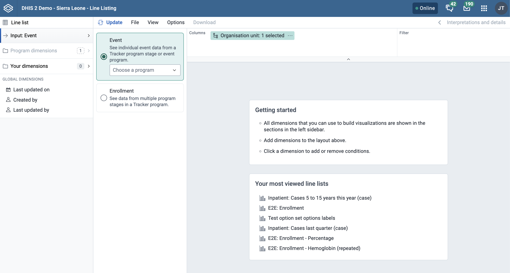
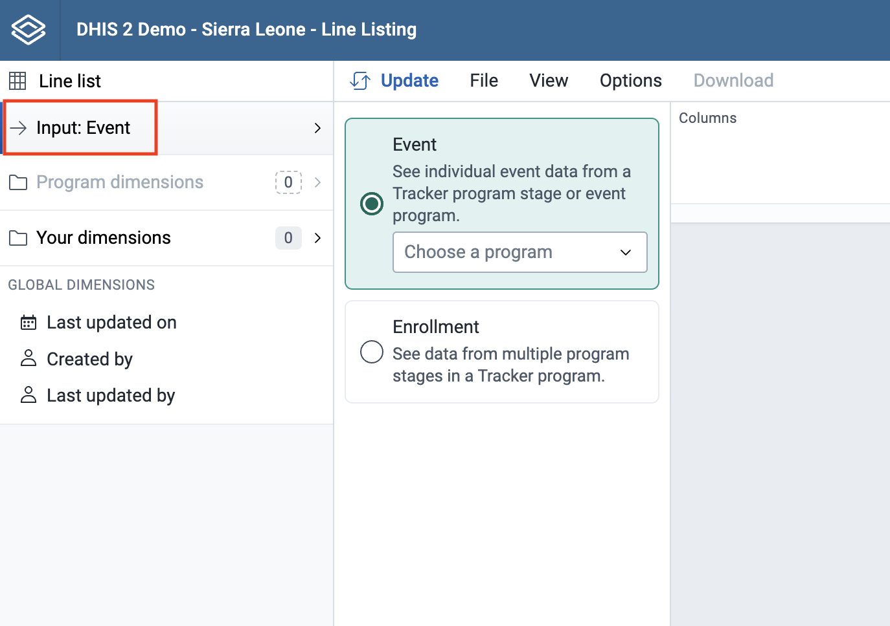
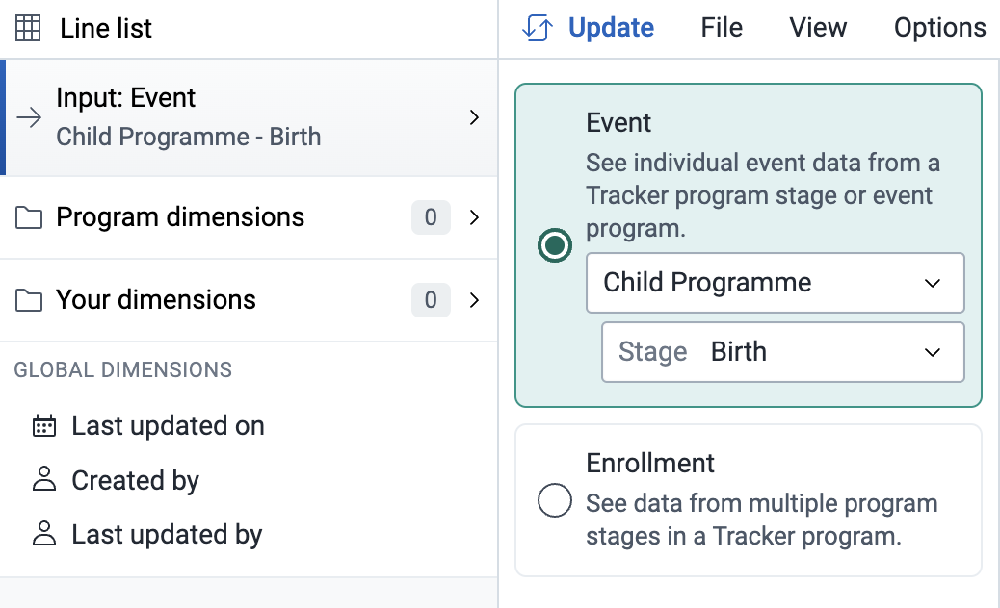
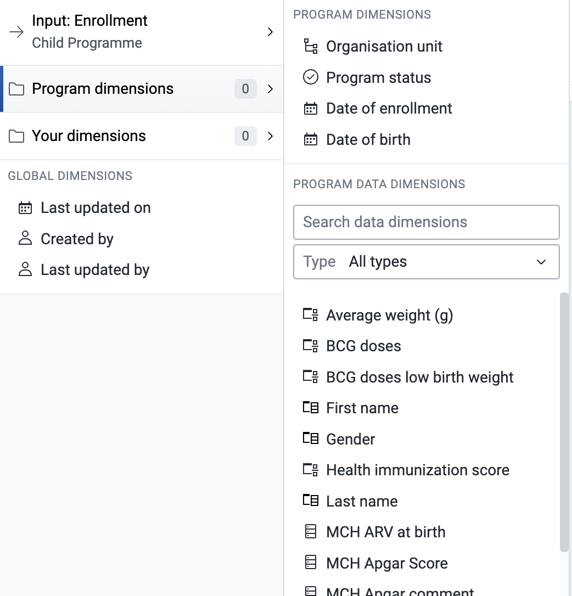
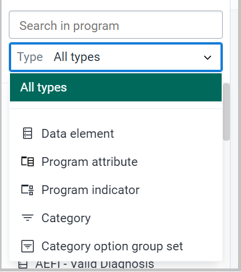
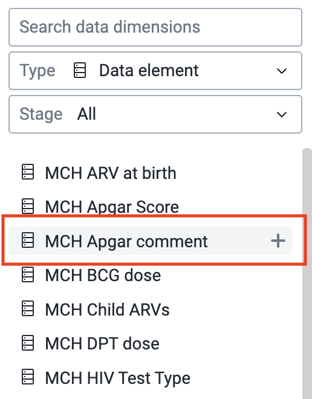
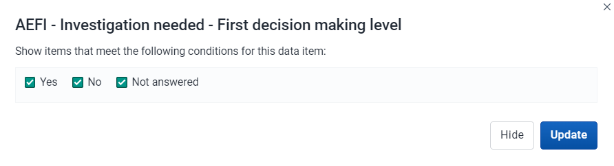
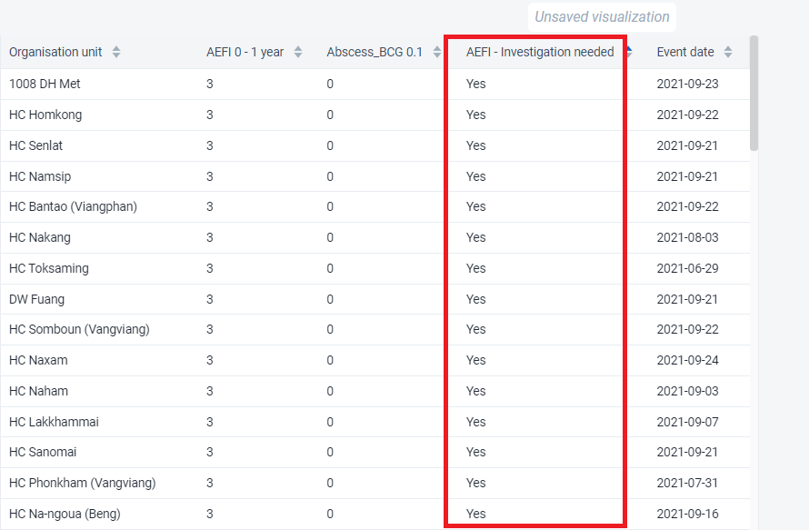
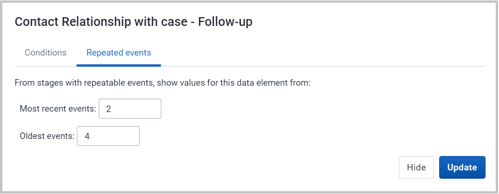

# Using the Line Listing app

The Line Listing app is a new app that replaces the line listing functionality in the Event Reports app, but also offers additional functionality.

> **NOTE**
>
> There will be a forward compatibility with the Event Reports app, which means that you can open the existing event reports of type line list in the Line Listing app, but you cannot save changes to them in the Line Listing app.

### Creating and editing a line list

When you open the Line Listing app from the DHIS2 menu, you are presented with a blank slate, and you can start creating a line list.

## Creating a line list

### Line list

In the Line Listing app, you currently only have one type of selection which is Line list.

### Input

(_This is the same as you see in the Event Reports app_). When you open the Input tab you will see below two options:

-   Event (see individual event data from an event program or a tracker program stage)
-   Enrollment (see data from multiple stages in a tracker program)

### Program Dimensions

(In the Event Reports app these are called data dimensions.)

The line list will always be based on event or tracker programs and you can do analysis on a range of dimensions. For programs with category combinations, you can use program categories and category option group sets as dimensions.

> **Tip**
>
> In the Line Listing app, all the dimensions related to a tracker or an event program are present in the program dimension component.

-   Choose a program

    Select program: All the event and tracker programs will be visible in the drop down.

    If you have selected the Event, then for tracker programs you need to select the program stage to get all the data elements, attributes for that particular stage. To be able to select data from multiple stages you need to select "Enrollment" as the input type.

If you select an event program you don’t have to select the stage (unlike the Event Reports app).

If you select Enrollment in the Input tab then all data elements associated with the program will be available from different stages within the program for the purpose of cross stage selection of data elements. Each data element will act as a dimension.

If you want to filter the data, by data elements, program attribute, program indicators, category, category option group set you can do so by clicking on the dropdown option.

There are multiple ways to add data elements to the layout. They can be added by hovering over the dimension and clicking the plus icon or by dragging and dropping a dimension straight to the layout area.

Alternatively, you can click on the respective data element and then choose to add it in column or filter as shown in below figure.

{ width=50% }

Each dimension can have criteria (filters). Data elements of the type option set allows for "in" criteria, where multiple options can be selected.

Numeric values can be compared to filter values using greater than, equal or less than operators. (Optional) For each data element, specify a filter with operators such as "greater than", "in" or "equal" together with a filter value.

> **Note**
>
> The enhancement in this feature is that you can add multiple conditions and there are also different operators which can be used. You can also filter by empty or not empty.

{ width=50% }

In the Line Listing app for BOOLEAN type data element, here in the analysis it will show “Yes”, ”No”, ”Not answered” instead of 0 and 1 as in the Event Reports app or the Data Visualizer app.

The line list will be displayed as a table with one row per event. Each dimension can be used as a column in the table or as a filter.

### Your Dimension

All **Organisation Unit group sets** are present under **Your dimension** component for further evaluation or analysis.

### Main and Program Dimensions

#### Select Organisation Unit

The organisation unit dialog is flexible, offering essentially three ways of selecting organisation units:

-   Explicit selection: Use the **tree** to explicitly select the organisation units you want to appear in the visualization. If you right-click on an organisation unit you can easily choose to select all org units below it.
-   Levels and groups: The **Level** and **Group** dropdowns are a convenient way to select all units in one or more org unit groups or at specific levels. Example: select *CH Mahosot* (level 3) to get all org units at that level.

    > **NOTE**
    >
    > Please note that as soon as at least one level or group has been selected the org unit tree now acts as the boundary for the levels/groups. Example: if you select CH Mahosot (level 3) and Vientiane Capital org unit (at level 2) in the tree you get all units inside that district.\_

-   The user's organisation units:
    -   User organisation unit: This is a way to dynamically select the org units that the logged in user is associated with.
    -   User sub-units: Selects the subunits of the user organisation unit.
    -   User sub-x2-units: Selects the units two levels below the user organisation unit.

#### Event Status

Filters data based on the event status:  **Active**, **Completed**, **Scheduled**.

You can visualize the data for a particular event status

#### Program Status

Filters data based on the program status: **Active**, **Completed** or **Cancelled**.

#### Created by / Last updated by

Will display the data based on who created the particular event.

### Time Dimensions

This is a new feature in Line Listing app where you will be able to view the data on the basis of different time dimensions.

-   Event date/Report Compilation date
-   Date patient notified in the health system.
-   Incident date
-   Last updated on
-   Scheduled date

You can click on the above time dimension to visualize data on different period dimension, a window will open where you can select one or several periods.

You have three period options: relative periods, fixed periods and start/end dates. You can combine fixed periods and relative periods in the same table You cannot combine fixed periods and relative periods with start/end dates in the same table Overlapping periods are filtered so that they only appear once.

-   Fixed periods: In the **Select period type** box, select a period type. You can select any number of fixed periods from any period type. Fixed periods can for example be "January 2021".
-   Relative periods: In the lower part of the **Periods** section, select as many relative periods as you like. The names are relative to the current date. This means that if the current month is March and you select **Last month**, the month of February is included in the visualization. Relative periods have the advantage that it keeps the data in the report up to date as time goes.
-   Start/end dates: Next to Choose form presets, select **Start/end dates**. This period type lets you specify flexible dates for the time span in the report.

### Column Header

You can sort on all column headers

You can filter the specific column by directly clicking the data elements or attributes at the column and you will be able to sort the data values

> **Example**
>
> In the below screenshot, we have selected AEFI – Headache.
>
> 
>
> Once we click on AEFI – Headache we will get a dialog box where we need to select the option we want to filter out. In this we have selected “Yes” only.
>
> { width=50% }
>
> Once we click on update, we will get the line list with only “Yes” under AEFI – Headache.
>
> 

### Repeatable Events

This is a new feature in the Line Listing app.

If the program stage has a data element in a repeatable event you can click on the data element and the window will open up where you will be able to see the Repeated event tab

{ width=50% }

Then, you can define the most recent events and the oldest events you want in the output as displayed below.

{ width=50% }

Once you click on update you will be able to visualize the events of this repeatable program stage as shown below.

### Applying legend colors

You can apply colors to a visualization by using the legend feature, which can be found under `Options` -> `Legend`

| Option                             | Description                                                                                                                                                                                                                                                                                                                                                      |
| ---------------------------------- | ---------------------------------------------------------------------------------------------------------------------------------------------------------------------------------------------------------------------------------------------------------------------------------------------------------------------------------------------------------------- |
| Use a legend for table cell colors | Applies a legend to the visualization items, which is a value-based color for each item. The legends themselves are configured in the `Maintenance app`.                                                                                                                                                                                                         |
| Legend style                       | Controls where the color from the legend is applied, either to the text or the background. You can use this option for scorecards to identify high and low values at a glance.                                                                                                                                                                                   |
| Legend type                        | Controls which legend is applied. `Use pre-defined legend per data item` applies a legend to each data element or indicator individually, based on the legend assigned to each one in the `Maintenance app`. `Select a single legend for entire visualization` applies a single legend to all data items, chosen in a drop-down list of available legends. |
| Show legend key                    | Displays a key for the legend on the right side of the visualization, to indicate the value ranges and their respective color.                                                                                                                                                                                                                                   |

Below is an example of a line list with legend colors applied to the background, per data item.

### Showing the organisation unit hierarchy

You can show the full hierarchy path for organisation units by enabling the **Show organisation unit hierarchy** option in `Options` -> `Style`. When this is enabled, sorting on the organisation unit column will sort the organisation units alphabetically starting from the top level.

### Skip rounding for numeric values

You can control how numeric values are formatted by toggling the **Skip rounding** option in `Options` -> `Data`. When this is enabled, the numeric values are not rounded and all decimals are shown. By default rounding is applied.

Below is an example of the same table with and without the option applied.

### View options

To allow more space for the line list itself, there are various ways to hide panels on the top and sides:

1. The "full screen button" in the title bar will hide the main sidebar on the left and the layout panel at the top of the screen.
2. If the interpretations panel is expanded on the right, this can be hidden by clicking the "interpretations button" just below the user profile menu.
3. Each panel can also be shown/hidden by using the "View menu" in the main toolbar.

To provide more space for the content in the "Accessory Side Panel" it can be resized using the mouse as illustrated below:

Resizing can also be done using the left/right arrow key on the keyboard. These keyboard shortcuts become active after giving focus to the drag-handle (by repeatedly hitting the tab key):

To reset the "Accessory Side Panel" to its default width, the "View" menu can be used.

